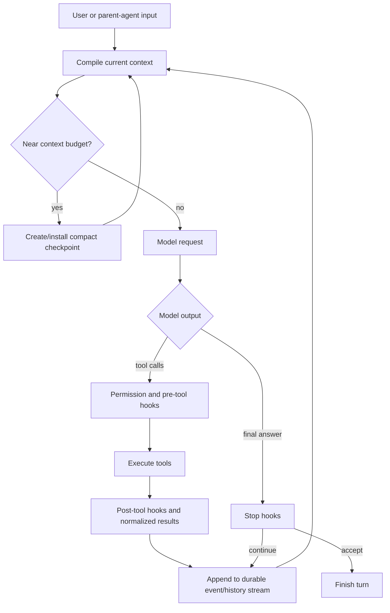
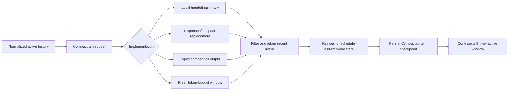

# Codex and Claude Code internals

A source-grounded guide to the agent loop, context management, compaction, hooks,
and subagents.

Snapshot date: **2026-07-16**

OpenAI Codex source: **`800715d201651a2a07c2706dca10400109dae3d3`**

Anthropic public repository: **`c39cb0f14bfe8bb519bae5bfc55add6867c5e2ab`**

## 1. Scope and evidence

OpenAI publishes Codex's implementation. The Codex half of this guide traces
concrete Rust types, functions, control flow, and persistence behavior in the
[pinned source tree](https://github.com/openai/codex/tree/800715d201651a2a07c2706dca10400109dae3d3).

Anthropic does not publish Claude Code's core runtime in its
[official public repository](https://github.com/anthropics/claude-code/tree/c39cb0f14bfe8bb519bae5bfc55add6867c5e2ab).
That repository contains plugins, examples, a changelog, installation material,
and issue automation—not the agent harness implementation.

The user-suggested `tanbiralam/claude-code` repository
[self-identifies as leaked source and Anthropic's property](https://github.com/tanbiralam/claude-code#disclaimer).
It was therefore not cloned or analyzed. The Claude Code half below is a
clean-room explanation based on Anthropic's official documentation and public
artifacts.

This guide uses four evidence labels:

- **Codex source:** directly verified in the pinned open-source implementation.
- **Public contract:** behavior explicitly documented by OpenAI or Anthropic.
- **Inference:** a plausible implementation model that explains public behavior,
  but not a claim about private source.
- **Version-sensitive:** a detail likely to change, so the date and source matter.

The local snapshots and provenance are recorded in
[`reference/agent-internals/README.md`](../reference/agent-internals/README.md).

## 2. The shortest useful mental model

Neither product is “just a chat client.” Each is an agent harness around a model:

1. Compile a model-visible view from persistent instructions, current state,
   conversation history, and tool definitions.
2. Ask the model for text, reasoning, or tool calls.
3. Validate proposed actions against permissions and pre-action hooks.
4. Execute tools, capture results, and append them to conversation state.
5. Re-enter the model until it returns a final answer.
6. Near the context limit, replace older detail with a compact checkpoint.
7. For delegated work, run another copy of the loop with its own context and
   return a bounded result to the parent.

The important distinction is:

> **Durable session state is not the same thing as the prompt sent on the next
> model request.**

Both systems persist more information than they keep in active context.
Compaction changes the model's active view while preserving a resumable audit
trail.



## 3. OpenAI Codex: direct source trace

### 3.1 Code map

| Concern | Primary source |
| --- | --- |
| Turn-level agent loop | [`session/turn.rs`](https://github.com/openai/codex/blob/800715d201651a2a07c2706dca10400109dae3d3/codex-rs/core/src/session/turn.rs#L144-L435) |
| Prompt/API request construction | [`client.rs`](https://github.com/openai/codex/blob/800715d201651a2a07c2706dca10400109dae3d3/codex-rs/core/src/client.rs#L824-L900) |
| In-memory history normalization | [`context_manager/history.rs`](https://github.com/openai/codex/blob/800715d201651a2a07c2706dca10400109dae3d3/codex-rs/core/src/context_manager/history.rs#L36-L185) |
| Initial context and incremental updates | [`session/mod.rs`](https://github.com/openai/codex/blob/800715d201651a2a07c2706dca10400109dae3d3/codex-rs/core/src/session/mod.rs#L3159-L3646) |
| Local compaction | [`compact.rs`](https://github.com/openai/codex/blob/800715d201651a2a07c2706dca10400109dae3d3/codex-rs/core/src/compact.rs#L52-L368) |
| Remote compaction v2 | [`compact_remote_v2_attempt.rs`](https://github.com/openai/codex/blob/800715d201651a2a07c2706dca10400109dae3d3/codex-rs/core/src/compact_remote_v2_attempt.rs#L32-L139) |
| Hook discovery and dispatch | [`hooks/src/engine/discovery.rs`](https://github.com/openai/codex/blob/800715d201651a2a07c2706dca10400109dae3d3/codex-rs/hooks/src/engine/discovery.rs#L63-L607) and [`dispatcher.rs`](https://github.com/openai/codex/blob/800715d201651a2a07c2706dca10400109dae3d3/codex-rs/hooks/src/engine/dispatcher.rs#L27-L153) |
| Subagent tool entry point | [`multi_agents_v2/spawn.rs`](https://github.com/openai/codex/blob/800715d201651a2a07c2706dca10400109dae3d3/codex-rs/core/src/tools/handlers/multi_agents_v2/spawn.rs#L40-L225) |
| Agent thread lifecycle | [`agent/control/spawn.rs`](https://github.com/openai/codex/blob/800715d201651a2a07c2706dca10400109dae3d3/codex-rs/core/src/agent/control/spawn.rs#L327-L697) |
| Agent registry and limits | [`agent/registry.rs`](https://github.com/openai/codex/blob/800715d201651a2a07c2706dca10400109dae3d3/codex-rs/core/src/agent/registry.rs#L16-L325) |

### 3.2 The turn loop

**Codex source.** The main turn path is `run_turn`:

1. **Compact before accepting more context when necessary.** Codex can run
   pre-sampling compaction before recording new user content.
2. **Capture a step snapshot.** A `StepContext` freezes configuration and world
   state for one sampling cycle.
3. **Record context changes.** The first cycle installs full context; later
   cycles normally append only differences.
4. **Resolve skills and plugins.** Skill descriptions can be available for
   selection while full instructions load only when activated.
5. **Run start/prompt hooks.** Allowed model-visible output becomes context.
6. **Build a normalized prompt.** Pending steering input is drained, history is
   normalized, tools are built, and the model request is assembled.
7. **Stream the response.** Tool calls become asynchronous futures; results are
   collected and normalized before the next sampling cycle.
8. **Update token accounting.** If continuation is required and the window is
   full, Codex compacts *mid-turn* and continues.
9. **Run stop hooks.** A stop hook can inject a continuation fragment and cause
   another model cycle instead of ending the turn.

The outer control flow is visible in
[`run_turn`](https://github.com/openai/codex/blob/800715d201651a2a07c2706dca10400109dae3d3/codex-rs/core/src/session/turn.rs#L144-L435);
prompt construction is in
[`build_prompt`](https://github.com/openai/codex/blob/800715d201651a2a07c2706dca10400109dae3d3/codex-rs/core/src/session/turn.rs#L1102-L1117);
and streaming/tool dispatch is in
[`try_run_sampling_request`](https://github.com/openai/codex/blob/800715d201651a2a07c2706dca10400109dae3d3/codex-rs/core/src/session/turn.rs#L1955-L2495).

The API payload contains base instructions, normalized messages and tool
call/results, current tool schemas, automatic tool choice, the parallel-tool
flag, reasoning settings, encrypted reasoning content when supported, and a
prompt-cache key normally derived from the session ID. See the
[request builder](https://github.com/openai/codex/blob/800715d201651a2a07c2706dca10400109dae3d3/codex-rs/core/src/client.rs#L824-L900)
and
[session-scoped model client](https://github.com/openai/codex/blob/800715d201651a2a07c2706dca10400109dae3d3/codex-rs/core/src/client.rs#L469-L484).

### 3.3 Context is a compiled projection

Codex has context layers with different lifetimes:

| Layer | Examples | Lifecycle |
| --- | --- | --- |
| Base instructions | Model/provider instructions and core policy | Supplied separately on each request |
| Developer context | Permission/sandbox/collaboration mode, personality, developer instructions, skills and plugins | Full install at a new baseline; later changes emitted as diffs |
| World state | `AGENTS.md`, environment, filesystem/network state, subagent state | Snapshotted; later changes diffed against a baseline |
| Tool catalog | Shell, patch, MCP, collaboration, and app tools | Rebuilt for the current turn and sent as schemas |
| Conversation items | Messages, tool calls/results, hook-injected context | Ordered history normalized before sampling |
| Durable rollout | Conversation plus lifecycle events, turn/world-state records, compact checkpoints | Persisted for resume/audit even after leaving the prompt |

The initial builder aggregates current settings and world state in
[`build_initial_context_with_world_state_and_mcp`](https://github.com/openai/codex/blob/800715d201651a2a07c2706dca10400109dae3d3/codex-rs/core/src/session/mod.rs#L3159-L3473).
The update path checks whether a reference baseline exists. With no baseline it
emits full context and records a world-state snapshot; otherwise it emits only
settings and world-state differences:
[`record_context_updates_and_set_reference_context_item`](https://github.com/openai/codex/blob/800715d201651a2a07c2706dca10400109dae3d3/codex-rs/core/src/session/mod.rs#L3549-L3646).

That baseline matters after compaction. Codex either reinserts full current
context immediately or clears the reference marker so the next ordinary turn
knows to reinsert it. A compact summary therefore never becomes the only
surviving description of permissions, instructions, or workspace state.

#### History normalization

Before sampling, the context manager:

- filters items that should not go back to the model;
- ensures every function/custom-tool call has an output;
- removes orphan outputs;
- strips images when the selected model cannot accept them;
- truncates tool outputs under a configured budget;
- preserves ordered call/result relationships.

See
[`record_items`](https://github.com/openai/codex/blob/800715d201651a2a07c2706dca10400109dae3d3/codex-rs/core/src/context_manager/history.rs#L120-L135)
and
[`process_item`/normalization](https://github.com/openai/codex/blob/800715d201651a2a07c2706dca10400109dae3d3/codex-rs/core/src/context_manager/history.rs#L355-L412).

Local token estimates are deliberately approximate byte-based heuristics, then
reconciled with server-reported usage when available. “90% full” is a control
signal, not proof that a local tokenizer counted every token exactly. See
[token estimation](https://github.com/openai/codex/blob/800715d201651a2a07c2706dca10400109dae3d3/codex-rs/core/src/context_manager/history.rs#L160-L185)
and
[total usage reconciliation](https://github.com/openai/codex/blob/800715d201651a2a07c2706dca10400109dae3d3/codex-rs/core/src/context_manager/history.rs#L326-L346).

### 3.4 How Codex compacts context

#### Triggering

**Codex source.** A model's default automatic-compaction threshold is 90% of
its resolved context window. An explicit model threshold is clamped to that
90% ceiling:
[`ModelInfo::auto_compact_token_limit`](https://github.com/openai/codex/blob/800715d201651a2a07c2706dca10400109dae3d3/codex-rs/protocol/src/openai_models.rs#L407-L468).

The context-window controller can measure either total active context or the
body after a stable prefix. It also checks the hard window limit and can reserve
a fallback buffer:
[`ContextWindowUsage`](https://github.com/openai/codex/blob/800715d201651a2a07c2706dca10400109dae3d3/codex-rs/core/src/session/context_window.rs#L1-L91).

Compaction can happen manually, before a turn, in the middle of a tool-driven
turn, when switching to an incompatible/smaller model context, or while
recovering from a context-limit response.

#### The dispatcher chooses a compaction implementation

The selection path in
[`run_auto_compact`](https://github.com/openai/codex/blob/800715d201651a2a07c2706dca10400109dae3d3/codex-rs/core/src/session/turn.rs#L972-L1048)
supports four strategies:

1. **Token-budget reset.** A feature-gated path starts a new window without
   model/server summarization, while still emitting the normal compaction
   lifecycle and hooks. See
   [`compact_token_budget.rs`](https://github.com/openai/codex/blob/800715d201651a2a07c2706dca10400109dae3d3/codex-rs/core/src/compact_token_budget.rs#L20-L89).
2. **Remote compaction v2.** Codex appends a typed `CompactionTrigger` item to
   an ordinary Responses request and expects exactly one typed compaction
   output. See
   [`run_remote_compact_v2_attempt`](https://github.com/openai/codex/blob/800715d201651a2a07c2706dca10400109dae3d3/codex-rs/core/src/compact_remote_v2_attempt.rs#L32-L139).
3. **Remote compaction v1.** Codex sends the prompt to `responses/compact` and
   installs the returned replacement history. See
   [`compact_remote_request.rs`](https://github.com/openai/codex/blob/800715d201651a2a07c2706dca10400109dae3d3/codex-rs/core/src/compact_remote_request.rs#L25-L107)
   and the
   [endpoint definition](https://github.com/openai/codex/blob/800715d201651a2a07c2706dca10400109dae3d3/codex-rs/codex-api/src/endpoint/compact.rs#L35-L68).
4. **Local model-generated summary.** Codex asks the current model to create a
   handoff checkpoint, then constructs replacement history locally.

#### Local compaction, step by step

1. Run all matching `PreCompact` hooks. A blocking outcome aborts compaction.
2. Clone the normalized transcript and append either the configured compact
   prompt or Codex's default checkpoint prompt.
3. Call the model. If already too large, remove the oldest history item and
   retry while preserving tool-call/output invariants.
4. Treat the final assistant message as the compact summary.
5. Collect “real” user messages, excluding old synthetic compact summaries.
6. Retain the newest user messages within an approximate 20,000-token budget;
   truncate the oldest retained message if necessary.
7. Append the summary as a synthetic user-role message with a handoff marker.
8. Install replacement history, persist a `CompactedItem` checkpoint, advance
   the context-window identity, recompute usage, and run `PostCompact` hooks.

The request/retry path is
[`compact.rs`](https://github.com/openai/codex/blob/800715d201651a2a07c2706dca10400109dae3d3/codex-rs/core/src/compact.rs#L150-L368);
message collection and retention are in
[`collect_user_messages`](https://github.com/openai/codex/blob/800715d201651a2a07c2706dca10400109dae3d3/codex-rs/core/src/compact.rs#L503-L526)
and
[`build_compacted_history_with_limit`](https://github.com/openai/codex/blob/800715d201651a2a07c2706dca10400109dae3d3/codex-rs/core/src/compact.rs#L602-L663).
The
[default compact prompt](https://github.com/openai/codex/blob/800715d201651a2a07c2706dca10400109dae3d3/codex-rs/prompts/templates/compact/prompt.md)
asks for a concise handoff covering progress, decisions, constraints, next
steps, and critical data.

#### Pre-turn versus mid-turn replacement

- **Pre-turn/manual:** do not put full initial context inside the replacement.
  Clear the reference baseline so the next normal user turn reinjects current
  context.
- **Mid-turn:** insert full initial context immediately before the last real
  user message, then keep the compact summary last. The in-progress loop can
  continue with both current policy/state and the handoff.

This phase policy is encoded in
[`InitialContextInjection`](https://github.com/openai/codex/blob/800715d201651a2a07c2706dca10400109dae3d3/codex-rs/core/src/compact.rs#L56-L69).

#### Remote v2 retention

Remote v2 retains eligible user, developer, and system messages, filters stale
context items, applies a newest-first text budget, and appends the typed
compaction output. In this snapshot the retained-message budget is 64,000
tokens. See
[`build_v2_compacted_history`](https://github.com/openai/codex/blob/800715d201651a2a07c2706dca10400109dae3d3/codex-rs/core/src/compact_remote_v2.rs#L443-L574).

#### Guarantees and losses

Compaction is a lossy semantic checkpoint, not a byte-for-byte transcript. It
is safe because Codex keeps the durable rollout, a typed compact checkpoint and
replacement history, fresh permission/instruction/world-state context, recent
user intent, and normalized tool relationships.

Facts that must never be forgotten should live in `AGENTS.md`, checked-in
documentation, tests, or another durable source—not only in an early chat
message.



### 3.5 Codex hooks

OpenAI's current [Hooks documentation](https://learn.chatgpt.com/docs/hooks)
matches the source snapshot.

#### Lifecycle events

Codex exposes `SessionStart`, `UserPromptSubmit`, `PreToolUse`,
`PermissionRequest`, `PostToolUse`, `PreCompact`, `PostCompact`,
`SubagentStart`, `SubagentStop`, and `Stop`. The event-to-scope mapping is in
[`dispatcher.rs`](https://github.com/openai/codex/blob/800715d201651a2a07c2706dca10400109dae3d3/codex-rs/hooks/src/engine/dispatcher.rs#L142-L168).

#### Discovery and trust

Hooks compose from `hooks.json` beside an active config layer, inline
`[hooks]` tables in `config.toml`, enabled plugins, and managed sources.
Higher-precedence layers do not replace lower ones; all matching sources
compose.

Non-managed hooks are identified by a hash of the normalized definition.
New/changed hooks are skipped until trusted; managed hooks are trusted by
policy. Discovery is implemented in
[`discover_handlers`](https://github.com/openai/codex/blob/800715d201651a2a07c2706dca10400109dae3d3/codex-rs/hooks/src/engine/discovery.rs#L63-L607).

**Version-sensitive limitation:** only synchronous `command` handlers execute in
this snapshot. `prompt` and `agent` types are parsed but skipped, as are async
command handlers. The default timeout is 600 seconds.

#### Dispatch semantics

Handlers matching the same event start concurrently with `FuturesUnordered`.
Results return to configuration order for reporting:
[`execute_handlers`](https://github.com/openai/codex/blob/800715d201651a2a07c2706dca10400109dae3d3/codex-rs/hooks/src/engine/dispatcher.rs#L89-L116).
One hook therefore cannot prevent another matching hook from starting; side
effects must be concurrency-safe.

Commands run in the session working directory. Codex serializes JSON to stdin,
captures stdout/stderr, enforces the timeout, and kills the process on
cancellation:
[`command_runner.rs`](https://github.com/openai/codex/blob/800715d201651a2a07c2706dca10400109dae3d3/codex-rs/hooks/src/engine/command_runner.rs#L49-L195).

Important control outputs include:

- `PreToolUse`: deny, explain, update proposed input, or add model context;
- `PermissionRequest`: influence an approval request;
- `PostToolUse` and `UserPromptSubmit`: add context or stop processing;
- `PreCompact`/`PostCompact`: observe and optionally stop their phase;
- `Stop`: prevent completion and inject a continuation;
- start/stop events: observe subagent lifecycle and add allowed context.

Hook-provided context becomes developer messages recorded in conversation
history:
[`record_hook_additional_contexts`](https://github.com/openai/codex/blob/800715d201651a2a07c2706dca10400109dae3d3/codex-rs/core/src/hook_runtime.rs#L595-L615).
An over-verbose hook therefore increases active context until truncation or
compaction.

For `PreToolUse`, any blocking result wins. If no handler blocks and several
rewrite input, the implementation chooses the update associated with the latest
completion order:
[`events/pre_tool_use.rs`](https://github.com/openai/codex/blob/800715d201651a2a07c2706dca10400109dae3d3/codex-rs/hooks/src/events/pre_tool_use.rs#L71-L186).
Competing mutation hooks are best avoided.

### 3.6 Codex subagents

OpenAI's public [Subagents guide](https://learn.chatgpt.com/docs/agent-configuration/subagents)
describes the surface; the source shows the control plane.

#### One subagent is one agent thread

Each child is a separate Codex thread with its own turn loop, context manager,
durable rollout, and status stream. It has a parent edge and canonical path,
while inheriting runtime permissions, working directory, environment
selections, and execution policy.

Agents in one user session share `AgentControl` and `AgentRegistry`. The
registry atomically reserves capacity, unique paths, and nicknames:
[`AgentRegistry`](https://github.com/openai/codex/blob/800715d201651a2a07c2706dca10400109dae3d3/codex-rs/core/src/agent/registry.rs#L16-L325).

Separate contexts do **not** imply filesystem isolation. Parallel writers need
explicit file ownership or separate worktrees.

#### Spawn and context inheritance

The v2 `spawn_agent` tool accepts a message, canonical task name, optional
role/model/reasoning/service tier, and `fork_turns`:

| `fork_turns` | Child starting context |
| --- | --- |
| omitted or `"all"` | Full parent history |
| `"none"` | Fresh history plus delegation message |
| positive integer string | Last N parent turns plus delegation message |

Parsing is in
[`SpawnAgentArgs::fork_mode`](https://github.com/openai/codex/blob/800715d201651a2a07c2706dca10400109dae3d3/codex-rs/core/src/tools/handlers/multi_agents_v2/spawn.rs#L178-L225).
A full-history fork rejects role/model/reasoning overrides to remain compatible
with inherited context. Fresh/partial children may apply a role or model
override.

The fork path flushes pending parent rollout writes, loads stored model context,
optionally truncates to N turns, filters parent-only usage hints, and starts a
new thread:
[`spawn_forked_thread`](https://github.com/openai/codex/blob/800715d201651a2a07c2706dca10400109dae3d3/codex-rs/core/src/agent/control/spawn.rs#L526-L697).

Built-in roles in this snapshot are `default`, `explorer`, and `worker`:
[`agent/role.rs`](https://github.com/openai/codex/blob/800715d201651a2a07c2706dca10400109dae3d3/codex-rs/core/src/agent/role.rs#L305-L380).

#### Communication and completion

Agent messaging uses typed `InterAgentCommunication` operations:

- `send_message` queues a mailbox message without waking an idle target;
- `followup_task` delivers a message and starts/resumes a target turn;
- `wait_agent` waits for mailbox activity, steering input, or timeout;
- interrupt/list/status operations use the same shared control plane.

The delivery modes differ by the `trigger_turn` bit:
[`message_tool.rs`](https://github.com/openai/codex/blob/800715d201651a2a07c2706dca10400109dae3d3/codex-rs/core/src/tools/handlers/multi_agents_v2/message_tool.rs#L12-L129).
Waiting subscribes to the input queue:
[`wait.rs`](https://github.com/openai/codex/blob/800715d201651a2a07c2706dca10400109dae3d3/codex-rs/core/src/tools/handlers/multi_agents_v2/wait.rs#L36-L195).

When a child reaches a final state, a detached watcher sends the result to the
parent without necessarily starting a parent turn:
[`maybe_start_completion_watcher`](https://github.com/openai/codex/blob/800715d201651a2a07c2706dca10400109dae3d3/codex-rs/core/src/agent/control.rs#L431-L517).
The parent receives a structured `FINAL_ANSWER` envelope. Completion payloads
are bounded to approximately 1,000 tokens:
[`session_prefix.rs`](https://github.com/openai/codex/blob/800715d201651a2a07c2706dca10400109dae3d3/codex-rs/core/src/session_prefix.rs#L10-L43).

#### Capacity and depth

**Version-sensitive.** At the pinned commit:

- legacy multi-agent mode defaults to six subagent slots;
- v2 defaults to four resident agent threads per session including root, so
  three child slots are normally available;
- default spawn depth is one, so nesting requires raising the configured limit.

See
[the defaults](https://github.com/openai/codex/blob/800715d201651a2a07c2706dca10400109dae3d3/codex-rs/core/src/config/mod.rs#L205-L267)
and
[`effective_agent_max_threads`](https://github.com/openai/codex/blob/800715d201651a2a07c2706dca10400109dae3d3/codex-rs/core/src/config/mod.rs#L1444-L1457).

The reliable pattern is to delegate bounded, independent, high-output work;
give writers explicit ownership; keep requirements and cross-cutting decisions
in the parent; return distilled evidence rather than logs; and reuse a child for
follow-ups that need its accumulated context.

## 4. Claude Code: clean-room public-contract analysis

### 4.1 What is publicly available

The pinned
[`anthropics/claude-code` tree](https://github.com/anthropics/claude-code/tree/c39cb0f14bfe8bb519bae5bfc55add6867c5e2ab)
does not expose the runtime's main loop, context data structures, compressor, or
scheduler. Its
[`README.md`](https://github.com/anthropics/claude-code/blob/c39cb0f14bfe8bb519bae5bfc55add6867c5e2ab/README.md)
points users to the product installer and official docs; the repository holds
public plugins/examples and project administration material.

Accordingly, behavior below is **public contract** where linked to official
docs, exact private representations are not asserted, and the later “likely
architecture” section is explicitly inference.

### 4.2 Agent loop and persistence

Anthropic describes the loop as **gather context → take action → verify**, with
tool results feeding later decisions:
[How Claude Code works](https://code.claude.com/docs/en/how-claude-code-works).

Claude Code writes messages, tool calls, and results to plaintext JSONL under
`~/.claude/projects/`. This supports resume, rewind, and session forking.
File-edit checkpoints are separate, allowing code restoration without rewriting
conversation history. New sessions start with fresh context; `--resume` appends
to the same session, while session forking copies history to a new ID.

That public contract implies the same conceptual split as Codex: a durable
transcript, a materialized active model context, separate code checkpoints, and
model/tool-loop state. It does not reveal exact in-memory classes, queues, or
request builders.

### 4.3 Context composition

Anthropic's
[context-window guide](https://code.claude.com/docs/en/context-window)
documents what enters context.

Before the first prompt, active context can include:

- the system prompt and output style;
- project/user/managed `CLAUDE.md` instructions;
- auto memory;
- MCP tool names;
- skill descriptions;
- appended system-prompt content and environment metadata.

As work proceeds it adds user/assistant messages, file contents, command/tool
outputs, full skill bodies on invocation, path-scoped rules and nested
`CLAUDE.md` on matching file reads, and only the hook output that explicitly
injects context.

Claude Code uses progressive disclosure:

- full `CLAUDE.md` content is standing context;
- skill descriptions load at startup and full bodies load on invocation;
- MCP tool names are initially visible while full schemas are deferred;
- normal subagents receive isolated context rather than ordinary parent history.

The feature cost table is in
[Extend Claude Code](https://code.claude.com/docs/en/features-overview).
`/context` reports live composition; `/memory` reports loaded memory files.

Auto memory's startup load is currently capped at the first 200 lines or 25 KB
of `MEMORY.md`, whichever comes first:
[What Claude can access](https://code.claude.com/docs/en/how-claude-code-works#what-claude-can-access).
This is version-sensitive.

### 4.4 How Claude Code compresses context

#### Publicly verified sequence

Anthropic documents a two-stage pressure response:

1. Clear older tool outputs first.
2. If that is insufficient, summarize the conversation into compacted state.

See
[When context fills up](https://code.claude.com/docs/en/how-claude-code-works#when-context-fills-up).
Manual `/compact` triggers summarization on demand and accepts focus text such
as `/compact focus on the API changes`. A persistent “Compact Instructions”
section in `CLAUDE.md` can direct what the summarizer retains.

**Version-sensitive:** official cloud-session docs describe the default trigger
as approximately 95% of capacity. `CLAUDE_AUTOCOMPACT_PCT_OVERRIDE` can move
the trigger, and `CLAUDE_CODE_AUTO_COMPACT_WINDOW` can set a smaller effective
capacity:
[manage context](https://code.claude.com/docs/en/claude-code-on-the-web#manage-context)
and
[environment variables](https://code.claude.com/docs/en/env-vars).
Treat the percentage as a product default, not an invariant.

#### What survives compaction

| Mechanism | After compaction |
| --- | --- |
| System prompt and output style | Unchanged; outside ordinary message history |
| Project-root `CLAUDE.md` and unscoped rules | Re-read/reinjected |
| Auto memory | Re-read/reinjected |
| Path-scoped rules | Gone until another matching file read triggers them |
| Nested `CLAUDE.md` | Gone until a file in that subtree is read |
| Invoked skill bodies | Reattached, capped at 5,000 tokens per skill and 25,000 total; newer invocations win the shared budget |
| Hooks | External code; zero context unless output is injected |
| Subagent transcripts | Separate files; main-session compaction does not rewrite them |

Sources:
[What survives compaction](https://code.claude.com/docs/en/context-window#what-survives-compaction)
and
[skill content lifecycle](https://code.claude.com/docs/en/skills#skill-content-lifecycle).
Skill truncation keeps the beginning, so critical instructions belong near the
top.

#### Thrash protection

If a huge file/tool result immediately refills context after several
compactions, Claude Code stops retrying and reports auto-compaction thrashing.
Recovery is to read smaller slices, compact with narrower focus, delegate
high-volume work, or clear:
[Troubleshooting](https://code.claude.com/docs/en/troubleshooting#auto-compaction-stops-with-a-thrashing-error).

#### Not established by public docs

The docs do not expose the exact compact prompt, summary message role/type,
precise recent-message retention algorithm, call/result normalization, retry
code, or checkpoint schema. Those details cannot responsibly be claimed from
the public contract.

### 4.5 Claude Code hooks

Anthropic's current
[Hooks reference](https://code.claude.com/docs/en/hooks)
describes a larger surface than Codex's current engine.

#### Handler types

Depending on the event, Claude Code supports:

- `command`: local process receiving JSON on stdin;
- `http`: endpoint receiving the same JSON body;
- `mcp_tool`: invoke an MCP tool;
- `prompt`: ask a fast model for a structured decision;
- `agent`: run an agentic verifier with tool access.

Not every event supports every type. For example, `PreCompact` and
`PostCompact` support command, HTTP, and MCP-tool hooks, but not prompt/agent.
`SessionStart` and `Setup` support command and MCP-tool handlers.

#### Lifecycle surface

As of the snapshot date, documented events include:

- session/setup: `Setup`, `SessionStart`, `SessionEnd`;
- prompts/display: `UserPromptSubmit`, `UserPromptExpansion`,
  `MessageDisplay`;
- tools: `PreToolUse`, `PermissionRequest`, `PermissionDenied`,
  `PostToolUse`, `PostToolUseFailure`, `PostToolBatch`;
- agents/tasks: `SubagentStart`, `SubagentStop`, `TaskCreated`,
  `TaskCompleted`, `TeammateIdle`, `Stop`, `StopFailure`;
- configuration: `InstructionsLoaded`, `ConfigChange`, `CwdChanged`,
  `FileChanged`, `Notification`;
- worktrees: `WorktreeCreate`, `WorktreeRemove`;
- compaction: `PreCompact`, `PostCompact`;
- MCP elicitation: `Elicitation`, `ElicitationResult`.

The authoritative table is
[Hook lifecycle](https://code.claude.com/docs/en/hooks#hook-lifecycle).

#### Input, decisions, and context

Command hooks receive common JSON fields such as session ID, transcript path,
working directory, permission mode, and event name, plus event-specific fields.
The transcript writes asynchronously; a hook needing current final assistant
text should use the event field designed for it rather than assume JSONL has
caught up.

For command hooks, exit 0 is normal success, exit 2 is the blocking signal for
blockable events, and other nonzero statuses are normally non-blocking errors.
Event-specific JSON may allow, deny, update a tool request, or continue a loop.

`additionalContext` is wrapped in a system reminder at the firing point and
enters the next model request without appearing as an ordinary chat message.
Multiple hook values all apply. Values above 10,000 characters spill to a
session file and are replaced by a path and preview:
[Add context for Claude](https://code.claude.com/docs/en/hooks#add-context-for-claude).

`PreCompact` can block manual or automatic compaction. `PostCompact` receives
the generated summary but cannot change it:
[PreCompact](https://code.claude.com/docs/en/hooks#precompact).

Hooks execute with the authority of their configured command/endpoint. Treat
hook config as executable code, validate input, quote paths, bound output, and
avoid leaking secrets into either stdout or `additionalContext`.

### 4.6 Claude Code subagents

Anthropic's
[Subagents documentation](https://code.claude.com/docs/en/sub-agents)
provides a detailed public contract.

#### Fresh named subagent

A normal named subagent starts with fresh isolated context. It does not see
ordinary parent conversation history, skills invoked only in the parent, or
files read only by the parent.

It receives:

- its own system prompt and environment details;
- a delegation message summarizing the task;
- applicable `CLAUDE.md`/memory hierarchy, except built-in Explore and Plan;
- a startup git-status snapshot when enabled, again except Explore/Plan;
- full bodies of skills listed in the subagent definition;
- a sibling roster when messaging is available under the documented conditions.

Only result summary and small metadata return to the main conversation, keeping
high-volume reads/logs in the child.

#### Forked subagent

A fork inherits full parent conversation, system prompt, tools, model, and
message history. Subsequent tool calls stay in the fork; only its final result
returns. Forks trade input isolation for access to all prior decisions.
Model-initiated fork spawning is documented as experimental/version-sensitive.

#### Resume, persistence, and compaction

A resumable subagent retains its conversation, tool calls, results, and
reasoning. Claude can send another message to its ID/name; a completed agent can
auto-resume in the background subject to cancellation and permission rules.

Transcripts live at:

```text
~/.claude/projects/{project}/{sessionId}/subagents/agent-{agentId}.jsonl
```

They are independent of main-conversation compaction, survive session resume,
and are cleaned under `cleanupPeriodDays`, default 30 days. Subagents use the
same auto-compaction logic as the main conversation, including
`CLAUDE_AUTOCOMPACT_PCT_OVERRIDE`.

#### Nested subagents

**Version-sensitive correction to older descriptions:** since Claude Code
v2.1.172, a subagent can spawn its own children. The fixed maximum depth is
five; an agent at depth five does not receive the Agent tool. A fork cannot
spawn another fork, although it can spawn named agent types. Only the top-level
delegated summary reaches main; nested intermediate results stay in their
branch:
[Spawn nested subagents](https://code.claude.com/docs/en/sub-agents#spawn-nested-subagents).

Nesting can be disabled for a custom agent by omitting or denying the Agent
tool.

#### Permissions and agent teams

Agent messages do not count as user approval and cannot change another agent's
permissions, `CLAUDE.md`, or configuration. Built-ins include Explore, Plan,
and general-purpose; custom agents add tailored prompts, tools, skills, models,
and hooks.

Subagents are delegated runs inside one session, optimized to return a result to
the parent. Agent teams are longer-lived independent sessions with shared tasks
and peer-to-peer coordination.

### 4.7 Safe inference about private architecture

The following is **inference**, not source disclosure:

1. Durable JSONL plus compact boundaries suggests an append-oriented session log
   with a separately materialized active prompt.
2. Main/subagent transcript independence suggests each agent owns conversation
   state while a session scheduler tracks IDs, parentage, status, and messaging.
3. Reinjecting root memory after compact suggests classification by
   origin/lifecycle rather than summarizing one flat string.
4. Tool-output clearing before semantic summary suggests staged pressure
   management: deterministic eviction first, model compression second.
5. Typed hook inputs/outputs imply a lifecycle event bus with event-specific
   reducers for allow/block/context decisions.

These are useful design hypotheses, not facts about Anthropic's code.

## 5. Comprehensive comparison

| Mechanism | OpenAI Codex at pinned commit | Claude Code public contract on 2026-07-16 |
| --- | --- | --- |
| Core implementation | Open source; direct Rust trace | Proprietary; behavior documented, core unavailable |
| Durable session | Rollout with messages, events, turn/world-state records, compact checkpoints | Plaintext JSONL transcript; separate edit checkpoints |
| Active context | Normalized `ResponseItem` history plus instructions and tools | Conversation plus system instructions, memory, loaded files/skills, tools |
| Project instructions | `AGENTS.md` and world-state context | `CLAUDE.md`, rules, auto memory |
| Skills | Catalog/descriptions initially; full `SKILL.md` on activation | Descriptions initially; full body on use; bounded reinjection after compact |
| MCP context | Turn tool catalog; extensions may contribute context | Tool names initially, schemas deferred |
| Tool-output pressure | Truncated at insertion; old output can be rewritten before compact | Older tool outputs cleared before semantic summary |
| Default auto-compact | 90% of resolved window, clamped | Approximately 95%, configurable and version-sensitive |
| Local compact form | Recent real user messages plus synthetic handoff | Exact representation not public |
| Other compact modes | Remote v1, typed remote v2, feature-gated fresh window | Exact implementation not public |
| Instruction survival | Current context reinserted now or next turn via baseline reset | Root memory reinjected; path/nested rules wait for retrigger |
| Hook handler types | Synchronous command only in snapshot | Command, HTTP, MCP tool, prompt, agent depending on event |
| Hook surface | Ten core events | Broad session/prompt/tool/task/config/worktree/compact/MCP events |
| Hook context | Persisted developer messages | System reminders; large values spill to files |
| Normal subagent context | Configurable full, none, or last N turns | Fresh named agent; explicit fork for full context |
| Subagent result | Bounded structured completion message | Summary plus agent metadata |
| Subagent history | Independent Codex thread/rollout | Separate per-agent JSONL |
| Nesting | Default depth one, configurable | Fixed maximum depth five |
| Workspace risk | Separate contexts, normally shared filesystem | Separate contexts; same project unless worktree isolation is used |

The convergence matters more than surface differences: both treat context as a
budgeted materialized view, compaction as a checkpoint, hooks as lifecycle
policy/automation, and subagents as isolated loops controlling information
flow.

## 6. How to build a comparable agent harness

### 6.1 Separate durable log from model view

Use an append-only event model:

```text
SessionEvent =
  UserMessage
  | AssistantMessage
  | ToolCall
  | ToolResult
  | HookResult
  | SettingsChanged
  | WorldStateChanged
  | AgentMessage
  | TurnStarted
  | TurnCompleted
  | CompactionCheckpoint
```

Do not delete old events when compacting:

```text
active_prompt = materialize(events, current_checkpoint, current_config)
```

This preserves resume/audit, makes compact reversible at storage level, lets
prompt strategy evolve separately from transcript format, and gives subagent
forks a precise event boundary.

### 6.2 Make context origins typed

Every fragment should carry:

- role: system/developer/user/assistant/tool;
- origin: core, project instruction, skill, hook, tool, user, agent;
- lifetime: always, session, until compact, path-triggered, one request;
- priority: safety, user intent, task state, evidence, diagnostics;
- token cost;
- whether it may be summarized, truncated, or reloaded;
- source revision/hash.

Then compaction can “reinject standing instructions, summarize transient
history, evict diagnostics” rather than ask a model to reason over one untyped
blob.

### 6.3 Stage context-pressure management

First compute a usable input budget:

```text
usable_input =
  model_context_window
  - expected_output
  - tool_schema_reserve
  - safety_margin
```

Act in this order:

1. Remove deterministic low-value material: stale progress, duplicate previews,
   old verbose outputs with durable artifact references, and superseded state
   updates.
2. Truncate individual tool output at ingestion, preserving useful head/tail
   plus a file/path reference.
3. Compact semantically before the hard limit.
4. Detect thrashing. If post-compact context repeatedly exceeds threshold, stop
   retrying and report the largest contributors.

Use server token counts when available; use local estimates for proactive
decisions only.

### 6.4 Make compaction a transaction

A useful checkpoint schema:

```json
{
  "version": 1,
  "source_event_start": "event-id",
  "source_event_end": "event-id",
  "summary": {
    "goal": "...",
    "constraints": ["..."],
    "decisions": ["..."],
    "completed": ["..."],
    "in_progress": ["..."],
    "next_steps": ["..."],
    "modified_files": ["..."],
    "verification": ["..."],
    "critical_values": {"key": "value"},
    "open_risks": ["..."]
  },
  "retained_messages": ["message-id"],
  "world_state_baseline": "snapshot-id",
  "instruction_revisions": {"project": "hash"},
  "window_id": "uuid"
}
```

Install it transactionally:

1. run pre-compact policy;
2. create summary/replacement;
3. validate required fields and tool-call pairing;
4. write checkpoint to the durable log;
5. atomically switch the active-window pointer;
6. recompute usage;
7. run post-compact observers.

If anything before pointer switch fails, retain the old window.

### 6.5 Preserve pruning invariants

Never leave:

- a tool call without a result;
- a result without its call;
- a reference to an unresolvable attachment;
- a permission change without effective scope;
- a summary claiming unverified work passed;
- a world-state diff without a recoverable baseline.

Drop calls/results as units. When keeping a result, retain tool name, status,
identifier, and durable output location.

### 6.6 Build hooks as a typed event bus

```text
HookResult {
  verdict: abstain | allow | deny | continue
  reason?: string
  updated_input?: object
  additional_context?: string
  user_message?: string
  diagnostics?: object
}
```

Define an explicit reducer:

- deny beats allow;
- immutable safety fields cannot be rewritten;
- context concatenates only within a budget;
- conflicting rewrites fail closed or use documented precedence;
- observers cannot silently become policy enforcers;
- each timeout has an explicit fail-open/fail-closed rule.

Run independent hooks concurrently, serialize side effects targeting one
resource, hash/trust executable definitions, and record duration/status/decision
without recording secrets.

### 6.7 Treat subagents as a bounded task graph

```text
AgentNode {
  id
  canonical_path
  parent_id
  depth
  role
  status
  context_mode: fresh | full_fork | last_n_turns
  permission_profile
  workspace
  mailbox
  transcript
}
```

The scheduler should enforce maximum active agents and depth, unique paths,
cancellation propagation, no authority escalation by messaging, result-size
limits, clear shared-write ownership, and exactly-once completion notification.

Give the parent three communication semantics:

- **queue message:** deliver at the child's next safe boundary;
- **follow-up:** wake/resume the child;
- **wait:** yield until mailbox/status/user steering changes.

Prefer fresh context for isolated research, full fork when reconstructing
background costs more than copying it, and last-N turns when recent decisions
matter but old exploration does not.

### 6.8 Minimal loop pseudocode

```text
run_turn(input):
  append(UserMessage(input))
  run(UserPromptSubmit)

  while true:
    step = snapshot(config, world_state, mailbox)
    append(context_diffs(step))

    if context_budget_exceeded(step):
      install_compaction_checkpoint(step)

    prompt = materialize_and_normalize(step)
    response = model(prompt, tools_for(step))
    append(response.items)

    if response.has_tool_calls:
      calls = pre_tool_hooks_and_permissions(response.tool_calls)
      results = execute_allowed_calls(calls)
      append(normalize(results))
      run(PostToolUse, results)
      continue

    stop = run(Stop, response.final_text)
    if stop.requests_continuation:
      append(stop.context)
      continue

    append(TurnCompleted)
    return response.final_text
```

Each subagent runs the same function against a different `AgentNode` and active
context.

### 6.9 Tests that matter

Context:

- full initial context versus incremental diff;
- model/tool change invalidates the right cache prefix;
- unsupported images are removed;
- outputs truncate without losing identifiers;
- exact call/result pairing after normalization.

Compaction:

- manual, pre-turn, mid-turn, and overflow recovery;
- standing instructions survive/reload;
- recent corrections survive;
- old synthetic summaries do not accumulate;
- failed summary leaves old window active;
- repeated oversized output trips anti-thrash protection.

Hooks:

- matching handlers start concurrently;
- deny/allow/update reduction is deterministic;
- timeout and malformed output follow policy;
- injected context is bounded and attributed;
- stop hooks cannot loop indefinitely.

Subagents:

- capacity reservation is race-safe;
- depth limits hold under concurrent spawn;
- fresh/full/last-N forks contain expected events;
- messages cannot grant permission;
- result is delivered once and bounded;
- failures/interruption produce actionable status;
- parallel writers cannot silently overwrite one another.

### 6.10 Common failure modes

| Failure | Cause | Countermeasure |
| --- | --- | --- |
| Context rot | Logs and obsolete attempts remain in every request | Early truncation, child isolation, task-boundary clear/compact |
| Summary drift | Model checkpoint changes facts | Structured fields, source IDs, explicit unknowns, verification state |
| Lost standing rule | Rule existed only in old chat | Reload durable instructions after compact |
| Hook explosion | Each tool event injects verbose text | Budgets, deduplication, artifact references |
| Tool protocol corruption | Pruning separates calls/results | Normalize and prune pairs atomically |
| Shared-workspace conflict | Isolated contexts edit same files | Ownership map or worktrees |
| Permission laundering | Agent message is treated as approval | Only user/policy channel may change authority |
| Compact thrash | One item exceeds reclaimed space | Contributor report, chunking, delegation, retry cap |
| Parent pollution | Children return raw logs | Bounded result schema with artifact links |
| Stale world state | Summary preserves old branch/files/policy | Fresh snapshot plus versioned diffs |

## 7. Recommended reading order

For Codex:

1. [`run_turn`](https://github.com/openai/codex/blob/800715d201651a2a07c2706dca10400109dae3d3/codex-rs/core/src/session/turn.rs#L144-L435)
2. [`ContextManager`](https://github.com/openai/codex/blob/800715d201651a2a07c2706dca10400109dae3d3/codex-rs/core/src/context_manager/history.rs#L36-L185)
   and the
   [initial/diff context builder](https://github.com/openai/codex/blob/800715d201651a2a07c2706dca10400109dae3d3/codex-rs/core/src/session/mod.rs#L3159-L3646)
3. [local compaction](https://github.com/openai/codex/blob/800715d201651a2a07c2706dca10400109dae3d3/codex-rs/core/src/compact.rs#L52-L368),
   then remote v2
4. [hook dispatch](https://github.com/openai/codex/blob/800715d201651a2a07c2706dca10400109dae3d3/codex-rs/hooks/src/engine/dispatcher.rs#L27-L153)
   and
   [runtime integration](https://github.com/openai/codex/blob/800715d201651a2a07c2706dca10400109dae3d3/codex-rs/core/src/hook_runtime.rs#L103-L615)
5. [subagent spawning](https://github.com/openai/codex/blob/800715d201651a2a07c2706dca10400109dae3d3/codex-rs/core/src/tools/handlers/multi_agents_v2/spawn.rs#L40-L225),
   [thread creation](https://github.com/openai/codex/blob/800715d201651a2a07c2706dca10400109dae3d3/codex-rs/core/src/agent/control/spawn.rs#L327-L697),
   and
   [completion delivery](https://github.com/openai/codex/blob/800715d201651a2a07c2706dca10400109dae3d3/codex-rs/core/src/agent/control.rs#L431-L517)

For Claude Code's public contract:

1. [How Claude Code works](https://code.claude.com/docs/en/how-claude-code-works)
2. [Explore the context window](https://code.claude.com/docs/en/context-window)
3. [Create custom subagents](https://code.claude.com/docs/en/sub-agents)
4. [Hooks reference](https://code.claude.com/docs/en/hooks)
5. [Extend Claude Code](https://code.claude.com/docs/en/features-overview)

## 8. Bottom line

The central mechanism is disciplined information flow:

- maintain an authoritative event history;
- compile only context needed now;
- preserve standing policy outside lossy conversation history;
- compact into a verifiable handoff before exhausting the window;
- use hooks for deterministic lifecycle policy and side effects;
- use subagents to isolate high-volume work, not merely increase activity;
- return small, source-linked results to the coordinating context.

Codex exposes these ideas directly in source. Claude Code's official docs show
the same broad architecture at the behavioral boundary, while its exact private
implementation remains unknown.
