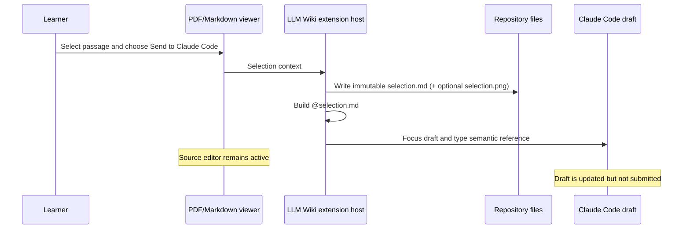

# Claude Direct Selection Handoff Design

**Date:** 2026-08-13  
**Status:** Approved

## Problem

LLM Wiki exports a selected Markdown or PDF passage to an immutable
`.llm_wiki/agent/exports/<id>/selection.md` snapshot and sends that context to
an installed agent draft.

The Claude Code adapter currently opens the exported Markdown in a preview
editor, selects every line, and invokes Claude Code's public
`insertAtMention` command. Claude receives the intended semantic
`@file#line-range` reference, but the temporary native editor becomes active
and leaves `selection.md` open instead of keeping the learner on the source
PDF or Markdown document.

Claude Code 2.1.229 still exposes only active-editor-based public commands for
creating an at-mention. It does not expose a public command that accepts an
arbitrary file URI or a native file-attachment API.

## Goals

- Preserve Claude's semantic full-file reference:
  `@.llm_wiki/agent/exports/<id>/selection.md#1-N`.
- Keep the source PDF or Markdown editor active.
- Put the reference into the existing Claude Code draft without submitting it.
- Avoid opening, revealing, or selecting the exported Markdown document.
- Preserve the immutable export and its optional relative
  `[selection.png](./selection.png)` evidence link.
- Keep Codex, Cursor Agent, and CodeBuddy handoff behavior unchanged.
- Document the provider-specific handoff behavior and filesystem-first design
  in the README.

## Non-goals

- Creating a native Claude attachment chip. Claude Code does not expose a
  public attachment command for this integration.
- Sending or submitting a Claude message.
- Attaching the PNG separately to Claude. Claude reads it through the relative
  link in `selection.md`.
- Replacing immutable selection exports or the latest-export aliases.

## Considered approaches

### 1. Direct semantic reference insertion — selected

Construct the same workspace-relative `@file#1-N` reference that Claude's
active-editor command produces, focus the Claude draft, and insert the
reference through VS Code's focused-input typing command.

Advantages:

- No temporary editor tab.
- No source-editor focus loss.
- The draft receives the same complete immutable Markdown snapshot.
- The implementation is small and provider-specific.

Trade-off:

- It relies on Claude Code's public focus command plus VS Code's stable
  focused-input `type` command rather than Claude accepting a URI argument.

### 2. Open, invoke, close, and restore

Keep the current active-editor workaround, then close the preview and restore
the source editor.

This is compatible with Claude's current command contract, but it can visibly
flash the exported document, mutates the editor layout, and treats the symptom
rather than removing the side effect.

### 3. Clipboard paste

Focus Claude, replace the clipboard with the reference, paste, and restore the
clipboard.

This adds unnecessary clipboard mutation and race conditions, so it is
rejected.

## Architecture

`packages/vscode-extension/src/agentHandoff.ts` remains the provider registry
and adapter boundary.

The Claude adapter will:

1. Resolve the exported Markdown to a workspace-relative path.
2. Read the text document without showing it, solely to determine the complete
   line range.
3. Format the semantic Claude reference as `@<relative-path>#1-N`.
4. Execute Claude's contributed focus/open command so an existing sidebar draft
   is targeted.
5. Execute VS Code's `type` command with the reference and a trailing space.

The adapter must not call `vscode.window.showTextDocument`, change a native
editor selection, or submit the draft.

The existing agent capability registry continues to use Claude's contributed
commands to determine whether the provider is available. Direct insertion is
an implementation detail of the Claude adapter, not a new advertised
capability.

## Data flow

## Error handling

- If Claude Code is unavailable, retain the existing provider warning.
- If the exported Markdown cannot be opened for line counting, report that
  Claude could not attach the selection.
- If Claude cannot focus or receive typed input, report the handoff failure and
  leave the source editor untouched.
- Do not fall back to opening `selection.md`; avoiding that editor side effect
  is a requirement.

## Testing

### Automated regression coverage

- The Claude reference formatter uses a workspace-relative path.
- A full document is represented as `#1-N`.
- The Claude handoff focuses Claude and types the semantic reference.
- The Claude path never calls `showTextDocument`.
- Codex, Cursor Agent, and CodeBuddy command behavior remains unchanged.

Tests must first fail against the current implementation and then pass after
the minimal adapter change.

### Live validation

Using the running Extension Development Host and Computer Use:

1. Keep a PDF passage selected.
2. Close any existing `selection.md` preview.
3. Clear the Claude draft.
4. Choose **Send to Claude Code**.
5. Verify the PDF remains the active editor.
6. Verify the Claude input contains the new immutable
   `@.../selection.md#1-N` reference.
7. Verify no message was submitted.

## README update

The README will describe:

- Explicit provider buttons and the shared **Add to Chat** action.
- Immutable `selection.md` snapshots and latest-export aliases.
- Claude's semantic full-file at-mention rather than a native attachment.
- Optional PDF crop evidence and provider-specific attachment limitations.
- The design choice to keep webviews focused on interaction while the extension
  host owns filesystem and agent integration.

