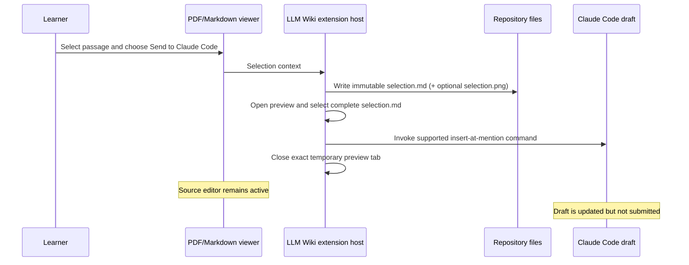

# Claude Direct Selection Handoff Design

**Date:** 2026-08-13  
**Status:** Approved

## Problem

LLM Wiki exports a selected Markdown or PDF passage to an immutable
`.llm_wiki/agent/exports/<id>/selection.md` snapshot and sends that context to
an installed agent draft.

The Claude Code adapter currently opens the exported Markdown in a preview
editor, selects every line, and invokes Claude Code's public
`insertAtMention` command. Claude receives the intended semantic
`@file#line-range` reference, but the temporary native editor becomes active
and leaves `selection.md` open instead of keeping the learner on the source
PDF or Markdown document.

Claude Code 2.1.229 still exposes only active-editor-based public commands for
creating an at-mention. It does not expose a public command that accepts an
arbitrary file URI or a native file-attachment API.

## Goals

- Preserve Claude's semantic full-file reference:
  `@.llm_wiki/agent/exports/<id>/selection.md#1-N`.
- Keep the source PDF or Markdown editor active.
- Put the reference into the existing Claude Code draft without submitting it.
- Leave no exported Markdown preview open after the handoff completes.
- Preserve the immutable export and its optional relative
  `[selection.png](./selection.png)` evidence link.
- Keep Codex, Cursor Agent, and CodeBuddy handoff behavior unchanged.
- Document the provider-specific handoff behavior and filesystem-first design
  in the README.

## Non-goals

- Creating a native Claude attachment chip. Claude Code does not expose a
  public attachment command for this integration.
- Eliminating Claude's transient native-editor requirement. Its public
  at-mention command reads only the active native text-editor selection.
- Sending or submitting a Claude message.
- Attaching the PNG separately to Claude. Claude reads it through the relative
  link in `selection.md`.
- Replacing immutable selection exports or the latest-export aliases.

## Considered approaches

### 1. Direct semantic reference insertion — rejected after live validation

Construct the same workspace-relative `@file#1-N` reference that Claude's
active-editor command produces, focus the Claude draft, and insert the
reference through VS Code's focused-input typing command.

The approach passed mocked command-order tests, but Computer Use validation in
Claude Code 2.1.229 showed that VS Code's programmatic `type` command is
ignored by the third-party webview even when its message input has focus.
Keyboard input works, but extensions cannot synthesize user keystrokes as a
production integration contract.

### 2. Open, invoke, close, and restore — selected

Use Claude's supported `insertAtMention` command, which requires an active
native editor:

1. Open the immutable `selection.md` as a preview.
2. Select its complete line range.
3. Capture the exact temporary `vscode.Tab`.
4. Invoke Claude's contributed insertion command.
5. Close only that captured tab through `vscode.window.tabGroups.close(...,
   true)`.

Closing with preserved focus leaves Claude's draft focused while the previous
source PDF or Markdown tab becomes selected again. The exported preview may be
transiently activated because Claude's public API requires it, but it does not
remain in the editor layout.

### 3. Clipboard paste

Focus Claude, replace the clipboard with the reference, paste, and restore the
clipboard.

This adds unnecessary clipboard mutation and race conditions, so it is
rejected.

## Architecture

`packages/vscode-extension/src/agentHandoff.ts` remains the provider registry
and adapter boundary.

The Claude adapter will:

1. Open the immutable Markdown in a preview text editor.
2. Capture the exact active tab created for that URI.
3. Select the complete document range.
4. Execute Claude's contributed at-mention command.
5. Close the captured tab with preserved focus.

The adapter must never close an unrelated tab and must not submit the draft.

The existing agent capability registry continues to use Claude's contributed
commands to determine whether the provider is available. Direct insertion is
an implementation detail of the Claude adapter, not a new advertised
capability.

## Data flow

## Error handling

- If Claude Code is unavailable, retain the existing provider warning.
- If the exported Markdown cannot be opened or selected, report that
  Claude could not attach the selection.
- If Claude's insertion command fails, close the captured preview in a `finally`
  block before reporting the handoff failure.
- If the mention succeeds but the temporary preview cannot be closed, preserve
  the successful draft and show a cleanup-specific warning.
- Match the captured tab by URI before closing it; an unrelated active tab must
  never be closed.

## Testing

### Automated regression coverage

- The Claude handoff selects the full exported document.
- The contributed insertion command runs exactly once.
- The exact temporary exported tab closes with preserved focus.
- An unrelated active tab is never closed.
- Codex, Cursor Agent, and CodeBuddy command behavior remains unchanged.

Tests must first fail against the current implementation and then pass after
the minimal adapter change.

### Live validation

Using the running Extension Development Host and Computer Use:

1. Keep a PDF passage selected.
2. Close any existing `selection.md` preview.
3. Clear the Claude draft.
4. Choose **Send to Claude Code**.
5. Verify the PDF remains the active editor.
6. Verify the Claude input contains the new immutable
   `@.../selection.md#1-N` reference.
7. Verify no `selection.md` preview remains open.
8. Verify no message was submitted.

## README update

The README will describe:

- Explicit provider buttons and the shared **Add to Chat** action.
- Immutable `selection.md` snapshots and latest-export aliases.
- Claude's semantic full-file at-mention rather than a native attachment.
- Optional PDF crop evidence and provider-specific attachment limitations.
- The design choice to keep webviews focused on interaction while the extension
  host owns filesystem and agent integration.
