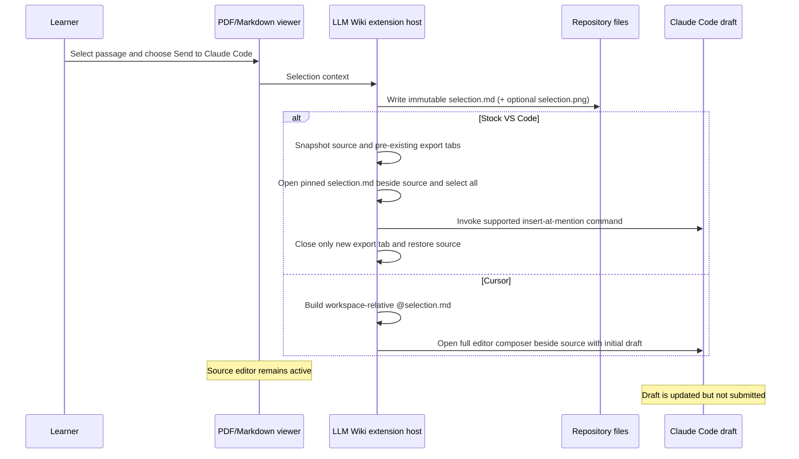

# Claude Direct Selection Handoff Design

**Date:** 2026-08-13
**Status:** Superseded by `2026-08-15-claude-sidebar-only-handoff-design.md`

## Problem

LLM Wiki exports a selected Markdown or PDF passage to an immutable
`.llm_wiki/agent/exports/<id>/selection.md` snapshot and sends that context to
an installed agent draft.

The Claude Code adapter currently opens the exported Markdown in a preview
editor, selects every line, and invokes Claude Code's public
`insertAtMention` command. Claude receives the intended semantic
`@file#line-range` reference, but the temporary native editor becomes active
and leaves `selection.md` open instead of keeping the learner on the source
PDF or Markdown document.

Claude Code 2.1.229 still exposes only active-editor-based public commands for
creating an at-mention. It does not expose a public command that accepts an
arbitrary file URI or a native file-attachment API.

Cursor 3.15.6 reserves its right-side Agents Window for native agent surfaces.
Claude's tab in that window is `claudeVSCodeSessionsList`, which lists sessions
but is not a message composer. Cursor does expose Claude's complete
`claudeVSCodePanel` as an editor and Claude's `editor.open` command accepts an
initial prompt.

## Goals

- Preserve Claude's semantic full-file reference:
  `@.llm_wiki/agent/exports/<id>/selection.md#1-N`.
- Keep the source PDF or Markdown editor active.
- Put the reference into the existing Claude Code draft without submitting it.
- Leave no exported Markdown preview open after the handoff completes.
- Preserve the immutable export and its optional relative
  `[selection.png](./selection.png)` evidence link.
- Keep Codex, Cursor Agent, and CodeBuddy handoff behavior unchanged.
- Use the complete Claude composer appropriate to each host instead of treating
  Cursor's session list as a draft surface.
- Document the provider-specific handoff behavior and filesystem-first design
  in the README.

## Non-goals

- Creating a native Claude attachment chip. Claude Code does not expose a
  public attachment command for this integration.
- Eliminating Claude's transient native-editor requirement. Its public
  at-mention command reads only the active native text-editor selection.
- Sending or submitting a Claude message.
- Attaching the PNG separately to Claude. The relative link in `selection.md`
  makes it available when visual evidence is needed.
- Replacing immutable selection exports or the latest-export aliases.

## Considered approaches

### 1. Direct semantic reference insertion — rejected after live validation

Construct the same workspace-relative `@file#1-N` reference that Claude's
active-editor command produces, focus the Claude draft, and insert the
reference through VS Code's focused-input typing command.

The approach passed mocked command-order tests, but Computer Use validation in
Claude Code 2.1.229 showed that VS Code's programmatic `type` command is
ignored by the third-party webview even when its message input has focus.
Keyboard input works, but extensions cannot synthesize user keystrokes as a
production integration contract.

### 2. Open, invoke, close, and restore — selected

In stock VS Code, use Claude's supported `insertAtMention` command, which
requires an active native editor:

1. Snapshot the active source tab's URI, custom-editor type, view column, and
   preview state.
2. Record any `selection.md` tabs that were already open.
3. Open the immutable export as a pinned temporary text editor in
   `ViewColumn.Beside`, preventing it from replacing a source or neighboring
   preview tab.
4. Select the complete line range and invoke Claude's contributed insertion
   command.
5. Close only a matching tab that did not exist before the handoff.
6. Explicitly reopen the source in its original editor type, column, and
   preview state.

An existing user-owned `selection.md` tab is never closed. Explicit source
restoration avoids relying on preview replacement or most-recently-used tab
behavior.

### 3. Cursor full editor with an initial reference — selected

In Cursor, construct the same workspace-relative full-file reference and call:

```typescript
vscode.commands.executeCommand(
  'claude-vscode.editor.open',
  undefined,
  reference,
  vscode.ViewColumn.Beside,
);
```

Claude opens its complete editor composer beside the source with the reference
already present in the unsent draft. This avoids Cursor's session-list-only
Agents Window and does not open `selection.md` as a text editor.

### 4. Clipboard paste

Focus Claude, replace the clipboard with the reference, paste, and restore the
clipboard.

This adds unnecessary clipboard mutation and race conditions, so it is
rejected.

## Architecture

`packages/vscode-extension/src/agentHandoff.ts` remains the provider registry
and adapter boundary.

The VS Code Claude adapter will:

1. Snapshot the active source editor.
2. Snapshot pre-existing tabs for the exported URI.
3. Open the immutable Markdown as a pinned text editor beside the source.
4. Identify the newly created matching tab by comparing the before/after tab
   sets.
5. Select the complete document range.
6. Execute Claude's contributed at-mention command.
7. Close only the newly created matching tab.
8. Explicitly restore the source editor.

The Cursor Claude adapter will:

1. Read the immutable document without showing it to determine the complete
   line count.
2. Format `@<workspace-relative-path>#1-N`.
3. Open Claude's complete editor composer beside the source with that reference
   as the initial draft.

The adapter must never close an unrelated tab and must not submit the draft.

The existing agent capability registry continues to use Claude's contributed
commands to determine whether the provider is available. Direct insertion is
an implementation detail of the Claude adapter, not a new advertised
capability.

## Data flow



## Error handling

- If Claude Code is unavailable, retain the existing provider warning.
- If the exported Markdown cannot be opened or selected, report that
  Claude could not attach the selection.
- If Claude's insertion command fails, close the owned temporary tab in a `finally`
  block before reporting the handoff failure.
- If the mention succeeds but the temporary tab cannot be closed or the source
  cannot be restored, preserve the successful draft and show a cleanup-specific
  warning.
- If insertion itself fails, do not claim that Claude received the selection.
- Match by URI and before/after tab identity; unrelated and pre-existing tabs
  must never be closed.
- In Cursor, require both Claude's mention capability and
  `claude-vscode.editor.open`; otherwise do not advertise the provider button.

## Testing

### Automated regression coverage

- The Claude handoff selects the full exported document.
- The contributed insertion command runs exactly once.
- A pinned temporary editor opens beside the source.
- The exact newly created exported tab closes.
- The source is explicitly restored in its original editor type and column.
- A pre-existing export tab is never closed.
- Combined insertion and cleanup failure does not produce a contradictory
  delivery-success warning.
- Cursor opens the full Claude editor beside the source, normalizes path
  separators, and seeds the complete immutable line range without showing
  `selection.md`.
- Cursor does not advertise Claude when the full editor command is unavailable.
- Codex, Cursor Agent, and CodeBuddy command behavior remains unchanged.

Tests must first fail against the current implementation and then pass after
the minimal adapter change.

### Live validation

Using the running Extension Development Host and Computer Use:

1. Keep a PDF passage selected.
2. Clear the Claude draft.
3. Choose **Send to Claude Code**.
4. In VS Code, verify the sidebar receives the reference and the source returns.
5. In Cursor, verify the full Claude editor opens beside the source with the
   reference as its initial draft.
6. Verify no new `selection.md` text-editor tab remains.
7. Verify no message was submitted.

## README update

The README will describe:

- Explicit provider buttons and the shared **Add to Chat** action.
- Immutable `selection.md` snapshots and latest-export aliases.
- Claude's semantic full-file at-mention rather than a native attachment.
- Optional PDF crop evidence and provider-specific attachment limitations.
- The design choice to keep webviews focused on interaction while the extension
  host owns filesystem and agent integration.
