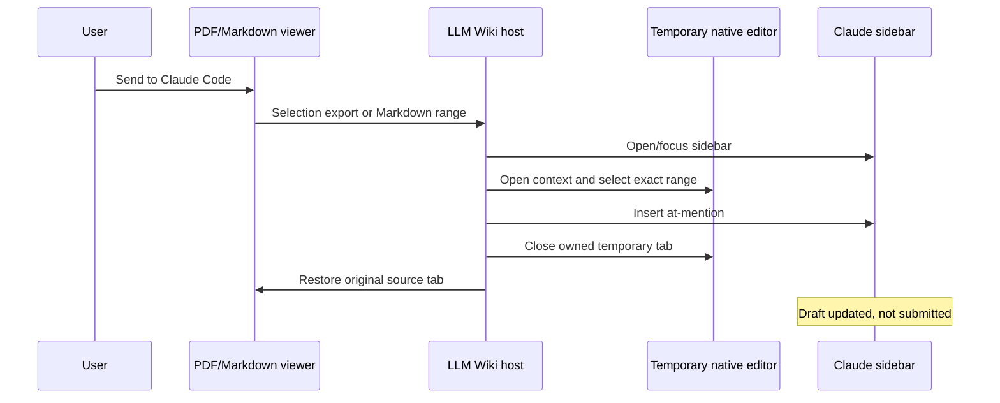

# Claude Sidebar-Only Handoff Design

**Date:** 2026-08-15
**Status:** Approved

## Problem

LLM Wiki exports selected Markdown and PDF passages to immutable
`.llm_wiki/agent/exports/<id>/selection.md` snapshots. Choosing **Send to
Claude Code** in Cursor currently calls `claude-vscode.editor.open` for an
exported selection. That command creates a Claude editor tab and usually a new
Claude session, even when the right-hand Claude sidebar already contains the
user's active conversation.

The explicit provider path (`handoffSelectionToAgentId`) bypasses the generic
visible-agent targeting path. In `executeAgentHandoff`, Cursor selection
exports deliberately take the editor-open fallback because only Markdown range
contexts are considered eligible for sidebar insertion.

The result is duplicate Claude surfaces and delivery into the wrong session.

## Desired Behavior

- Every LLM Wiki Claude handoff in Cursor targets the right-hand Claude
  sidebar.
- LLM Wiki never creates or targets a Claude editor tab.
- A currently open sidebar draft receives the selection reference without
  submission.
- If the sidebar is closed, the handoff opens it and inserts into that sidebar.
- If sidebar insertion is unavailable, LLM Wiki reports that Claude handoff is
  unavailable instead of opening an editor session.
- Exported PDF selections, exported Markdown selections, and direct Markdown
  ranges use the same sidebar-only rule.
- Claude's own editor-tab feature remains available when users open it
  themselves; LLM Wiki does not close or otherwise manage those tabs.

## Considered Approaches

### 1. Sidebar command contract — selected

Require Claude's public sidebar-open and at-mention insertion commands. Open or
focus the sidebar, create the native source selection required by
`insertAtMention`, invoke insertion, clean up the temporary source tab, and
restore the original editor.

This reuses Claude's supported selection-to-mention path and has deterministic
delivery semantics.

### 2. Focus-first insertion — rejected

Call Claude's generic focus command and then invoke insertion. The focus
command does not identify whether the sidebar or an editor tab received focus,
so it cannot enforce the sidebar-only contract.

### 3. Retain the editor fallback — rejected

Use the sidebar when possible but call `claude-vscode.editor.open` on older
Claude versions. This recreates the reported regression and contradicts the
sidebar-only requirement.

## Architecture

`packages/vscode-extension/src/agentHandoff.ts` remains the provider adapter
boundary.

### Capability detection

In Cursor, Claude is an available handoff provider only when all required
sidebar commands are registered:

- `claude-vscode.sidebar.open`
- one supported mention command:
  - `claude-vscode.insertAtMention`, or
  - `claude-code.insertAtMentioned`

`claude-vscode.editor.open` is not a handoff capability.

Stock VS Code retains its existing mention-command capability because its
supported path already selects a temporary native document and invokes mention
insertion without using Cursor's editor-open fallback.

### Delivery

For every Cursor Claude context:

1. Open or focus the Claude sidebar with `claude-vscode.sidebar.open`.
2. Snapshot the current restorable source tab and existing tabs for the
   context URI.
3. Open the context document as a temporary native text editor beside the
   source.
4. Select the requested Markdown line range or the complete exported
   `selection.md` document.
5. Invoke the supported Claude mention command exactly once.
6. Close only the temporary context tab created by the handoff.
7. Restore the source tab in its original editor type, column, and preview
   state.

The mention is inserted into the sidebar draft but is not submitted.

### Editor tabs

`claudeVSCodePanel` editor tabs are no longer treated as visible Claude
handoff targets. Their presence must not change the delivery destination.
LLM Wiki neither creates nor closes them.

## Data Flow

## Error Handling

- Missing sidebar-open or mention commands: do not advertise Claude as an
  available provider in Cursor and show the existing handoff-unavailable
  warning for explicit requests.
- Sidebar open or mention insertion failure: report that Claude could not
  attach the selection.
- Cleanup failure after successful insertion: keep the inserted draft and show
  the existing cleanup-specific warning.
- Always attempt owned-tab cleanup and source restoration in `finally`.
- Never call `claude-vscode.editor.open` as a fallback.
- Never close a pre-existing export tab, source tab, or user-created Claude
  editor tab.

## Testing

### Automated

- Replace the regression test that currently requires a new Claude editor with
  a sidebar-only exported-selection test.
- Assert command order: sidebar open, mention insertion, source restoration.
- Assert `claude-vscode.editor.open` is never invoked.
- Assert the complete exported document is selected before insertion.
- Assert Markdown range handoff continues to select only the requested lines.
- Assert temporary tabs are closed and pre-existing tabs are preserved.
- Assert Cursor capability detection requires sidebar-open plus mention
  insertion and ignores editor-open.
- Assert visible Claude editor tabs are not selected as handoff destinations.
- Preserve Codex, Cursor Agent, CodeBuddy, and stock VS Code behavior.

Tests must demonstrate the current failure before production code changes and
then pass after the minimal adapter fix.

### Cursor Extension Development Host

1. Keep an existing conversation in the right-hand Claude sidebar.
2. Select a PDF passage and choose **Send to Claude Code**.
3. Verify the mention appears in the existing sidebar draft.
4. Verify no Claude editor tab or new Claude session appears.
5. Verify no message is submitted.
6. Repeat with a Markdown range.

## Scope

This change affects only the destination used by LLM Wiki Claude handoffs. It
does not change selection export contents, optional image evidence, Claude's
own session-management UI, other agent providers, autosave, or Markdown
rendering.
